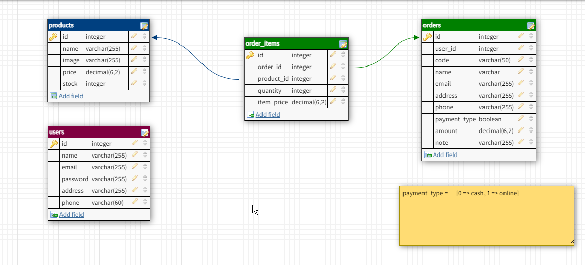

## Database schema


## Deploy
Install composer package
```shell script
    composer install --no-dev
```

Copy ```.env``` file from ``.env.example`` file
```shell script
    cp .env.example .env
```

Add database name, username and password
```dotenv
    DB_DATABASE=dbname
    DB_USERNAME=dbusername
    DB_PASSWORD=dbpassword
```
Generate new key
```shell script
    php artisan key:generate
```
Run migration and db seeders
```shell script
    php artisan migrate
    php artisan db:seed
```
Configure nginx configuration. Set root path ```[project_folder]/public```

Enjoy :) 
